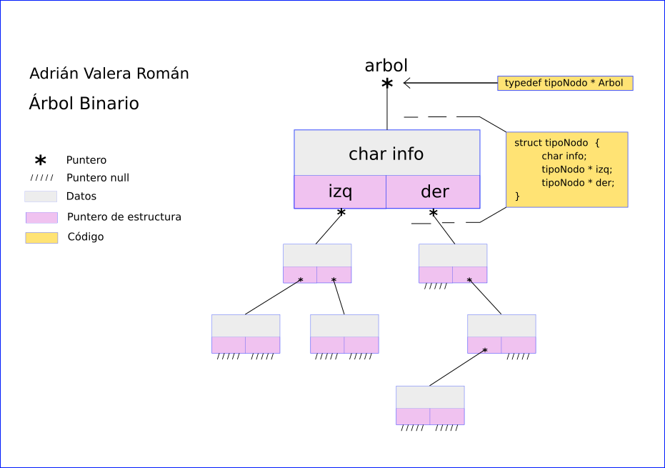
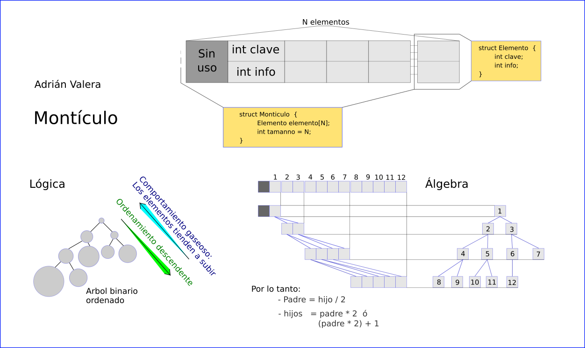
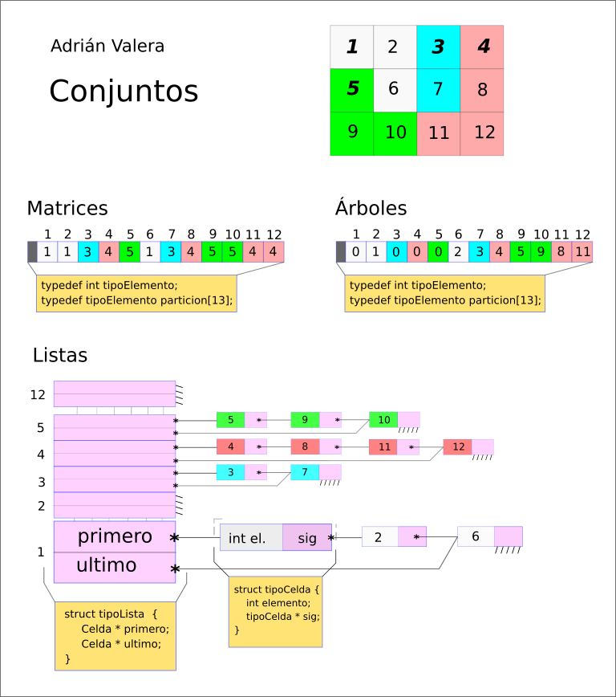
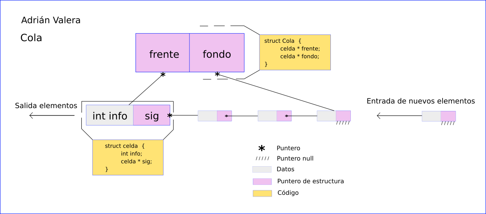
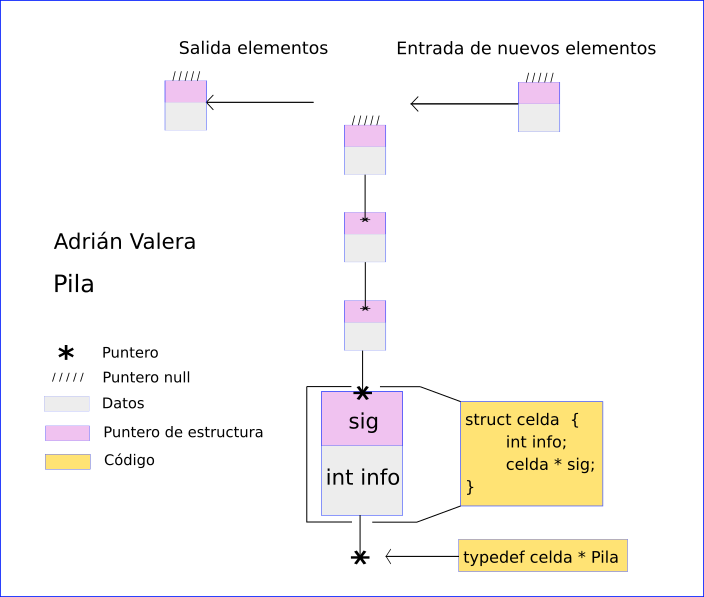

# Tipos Abstractos de Datos

El repositorio se organiza en carpetas, cada una de las cuales se corresponde
con un tipo de datos y tiene una serie de ejercicios realizados para comprobar
su funcionamiento.

El makefile encontrado en la carpeta principal permite compilar los ejercicios
desde fuera.

Los distintos .png esquematizan las estructuras de datos desarrolladas en sus
correspondientes carpetas.

Agradecimientos a @xuzengmao por las funciones implementadas en grafos: prim y kruskal. Así como a Mª José Polo, nuestra profesora, por facilitarnos funciones y ejercicios.

GITIGNORE: *.o y ejecutables *.TAD

# Estructuras:

### Arbol/Tree

### Montículo/Heap

### Conjunto/Set

### Cola/Queue

### Pila/Stack

